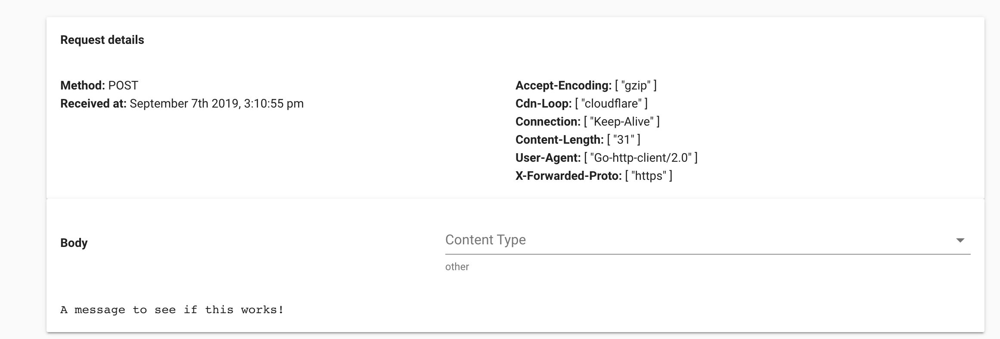

# golang-webhook

Based on https://webhookrelay.com/blog/2018/07/13/how-to-create-webhook/

`go run main.go`

```
Create webhooks on http://localhost:8090/webhooks
Type a message and press enter.
This message should appear in any other chat instances connected to the same
database.
Type "exit" to quit.
```

Create bin on webhookrelay:
https://bin.webhookrelay.com/v1/webhooks/<secret>

Run locally:

```
curl --request POST \
  --url http://localhost:8090/webhooks \
  --header 'content-type: application/json' \
  --data '{
    "name": "joe",
    "destination": "https://bin.webhookrelay.com/v1/webhooks/<secret>"
}'
```

Output:

```
Create webhooks on http://localhost:8090/webhooks
Type a message and press enter.
This message should appear in any other chat instances connected to the same
database.
Type "exit" to quit.
== New Distination Added ==
```

Type in terminal:
`A message to see if this works!`

Output:

```
...
== New Distination Added ==
A message to see if this works!
== Message Received ==
Webhook to 'https://bin.webhookrelay.com/v1/webhooks/<secret>' dispatched, response code: 200
```

Open browser: https://bin.webhookrelay.com/#/bins/<secret>


